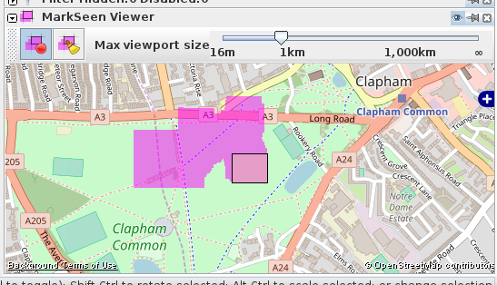

josm-markseen
=============



* JOSM plugin which marks 'seen' areas of the map.

* License: GPL v3 or later.

Building
--------

A `default.nix` file is provided for [Nix](https://nixos.org/nix) users which should provide *all* required dependencies for building & testing this project. A Nix user should be able to perform a

```
$ nix-shell --pure .
```

in the source directory and then use the regular `ant` commands `ant dist` and `ant test` to build & test the project respectively.
